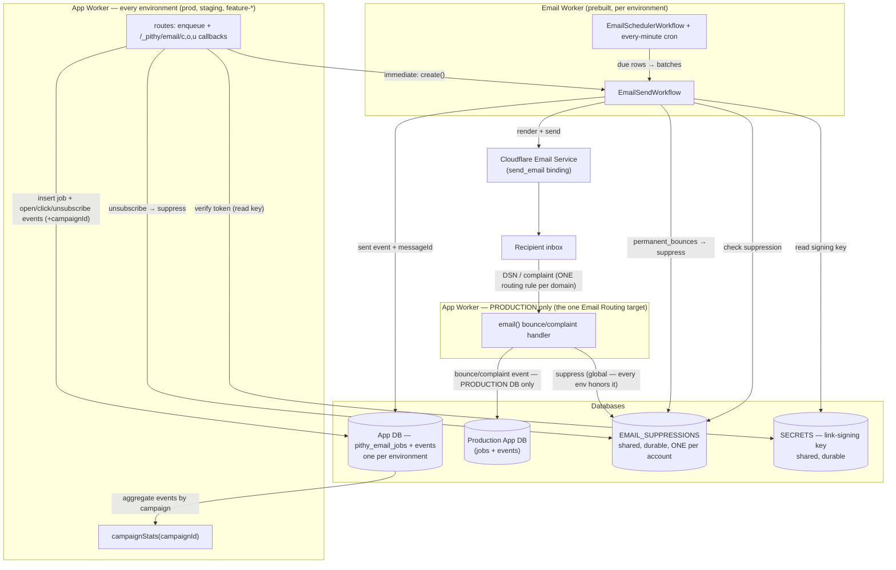

# @pithy-sh/email

D1-backed email for Cloudflare. Every send is a durable job: scheduled, retried, tracked. Themeable templates, click/open/unsubscribe tracking, and bounce-driven suppression. No mail ever sent inline.

## How it works

A request handler never sends email. It **enqueues a row** in `pithy_email_jobs`, and the actual `EMAIL.send()` always runs inside a Cloudflare Workflow — so every send is durable, retryable, and auditable.

There are three send modes. **Immediate** inserts a `pending` row and starts the send Workflow now. **Scheduled** inserts a `scheduled` row with an absolute `sendAt`. **Per-timezone** resolves a recipient's local time-of-day in their IANA zone to an absolute `sendAt`. An every-minute cron Workflow finds due rows and fans them out into sender batches sized to the volume due.

Links in a tracked email are HMAC-signed callbacks. A click goes through `/_pithy/email/c/<token>` (records the click, 302-redirects to the signed destination); an open loads `/_pithy/email/o/<token>.png`; an unsubscribe hits `/_pithy/email/u/<token>`. The signing key is a rotatable secret from `@pithy-sh/secrets`, and every token carries its key version so a link in a months-old email still verifies after a rotation.

`pithy add email` mints this project's **dev** signing key into the dev secrets file as `email-link-signing-key` — any random string signs a link this app also verifies, so there is nothing for you to invent. It is written only when absent: a new key breaks every link already in an inbox. Deployed environments need their own, with `pithy secrets create email-link-signing-key`.

## Deployment architecture



**How a bounce gets back — and the honest limit.** Cloudflare binds **one** Worker per domain to receive mail, so every DSN/complaint lands in the *production* app worker. From there:

- **Suppression is global.** The inbound worker writes the bounced/complained address into the shared `EMAIL_SUPPRESSIONS` DB, which every environment checks before sending — so the dangerous part (don't email this person again) is correct everywhere.
- **The bounce *event* is production-only.** The worker matches the DSN to its job by the original `Message-ID` and writes a `bounce`/`complaint` event (with that job's `campaignId`) into the **production** app DB — so a production campaign's `campaignStats` sees bounces beside its opens and clicks. It **cannot** write that event back to a staging or feature DB: those are separate, often ephemeral databases the single production worker has no binding to. There is no way around this with one inbound worker — the `X-Pithy-Env` header we stamp on each send lets the worker *know* which environment a bounce came from (for logging), but it can't reach that environment's database.

So non-production environments get their full open/click/unsubscribe funnel (those callbacks hit the *sending* env's own worker) plus the **synchronous** `permanent_bounces` captured at send time, but not *asynchronously*-routed bounce events. Production — where batch analytics actually matter — gets everything.

## Where the data lives

**Jobs and events are per-environment.** `pithy_email_jobs` and `pithy_email_events` live in the app `DB` — the same database as the app's own data, scoped to the environment that sent them. A feature branch's sends, history, and tracking are its own.

**Suppression is global.** `pithy_email_suppressions` lives in a dedicated, durable `EMAIL_SUPPRESSIONS` database — one per account, bound the same in every environment. An address that hard-bounced, complained, or unsubscribed must never be emailed from *any* environment, so this is the one resource shared across all of them. It mirrors the shared-DB pattern `@pithy-sh/secrets` uses for `SECRETS` (where the link-signing key lives).

**The reason decides what it blocks.** The list is keyed by address and holds no memory of which message somebody was refusing, so the send path reads the reason against the template's kind:

| reason | elective mail | transactional mail |
|---|---|---|
| `hard_bounce` | block | **block** — the mailbox does not exist. Sending is futile, and hammering dead addresses damages the sending domain for every other adopter on it. |
| `complaint` | block | **block** — continuing after a spam report is how a domain gets blocked outright. |
| `manual` | block | **block** — an operator's deliberate act. |
| `unsubscribe` | block | **send** — an opt-out is a statement about mail somebody chose to receive. A sign-in link is not that. |

Without that last row, one unsubscribe from a weekly digest also withheld the same person's magic link — and passwordless has no password to fall back on, so the account became permanently unreachable with nothing reported at either end. A skipped send is now named, not swallowed: `SendOutcome.suppressionReason` says which reason blocked it, and the job row and event carry it too.

## Management routes

Silent email failure costs a signup. These are the routes a dashboard reads to notice, mounted under `basePath` (default `/email`, set it in `email({ basePath: "/mail" })` and the manifest follows).

Every one is `control-plane` and **default-denied**: an M2M admin surface for a management client the adopter connected, verified by the core seam. There is no bearer or session surface here — a recipient's only routes are the click, open, and unsubscribe callbacks, which keep their fixed `/_pithy/email` prefix because those URLs are already minted into mail nobody can recall. With the control-plane seam uncomposed, all six answer 403.

| Method | Path | Scope |
|---|---|---|
| GET | `/email/jobs` | `email:jobs:read` |
| GET | `/email/jobs/:id` | `email:jobs:read` |
| POST | `/email/jobs/:id/retry` | `email:jobs:retry` |
| GET | `/email/suppressions` | `email:suppressions:read` |
| POST | `/email/suppressions` | `email:suppressions:write` |
| POST | `/email/suppressions/remove` | `email:suppressions:delete` |

Five scopes, not one admin flag, because these fail in five unrelated directions. Reading jobs discloses who you mailed. Retrying one sends real mail to a real person under your domain and DKIM. Reading suppressions discloses, in one list, every address in the project that ever bounced or opted out — across every environment, since that database is global. Adding a suppression is a targeted denial of service: a `manual` block stops every message to that address, transactional included, so that person never gets another magic link. Removing one re-opens sending to somebody who reported spam. Scopes match exactly, with no prefix or wildcard rule, so a tool that retries stuck receipts never also holds a suppression write.

**The template payload is never projected. Anywhere.** A `magicLink` job's `payload` holds a working sign-in URL and an OTP job's holds the code, so returning it on a read scope would turn the least privileged credential here into account takeover. There is no flag for it.

**The job list masks the recipient (`ad***@example.com`); the detail route returns the whole address.** That is a bulk-harvest control, not anonymisation: it takes the cost of exporting the list from one request per hundred addresses to one request per address, each individually audited. The domain survives masking, because that is what you read a deliverability problem off. The suppression list is the deliberate exception — an address *is* the record there, which is why reading it is its own scope.

**Every call is audited, reads included** (`email/jobs_read`, `email/job_read`, `email/job_retried`, `email/suppressions_read`, `email/suppression_added`, `email/suppression_removed`), through the `@pithy-sh/audit` seam. A block is silent to everyone it affects, so the trail is the only record it happened.

Both lists are cursor-paginated on `(createdAt, id)`, never offset — `pithy_email_jobs` is written to on every send, so an offset page shifts under whoever is reading it.

A retry is only ever accepted for a `failed` job, and only after re-checking the suppression list: `attempts` is reset (or `runSend`'s budget would end it again on the first retryable error), the row goes back to `pending`, and the send Workflow is dispatched. A dispatch that fails is reported, not fatal — the every-minute scheduler re-drives the row within the minute. A manual block is always recorded as `reason: "manual"`; the other three reasons are facts the system observed, and a management client observed none of them.

## Feature / staging / prod

Each environment sends its own jobs, recorded in its own app DB. They all read and write **one** shared `EMAIL_SUPPRESSIONS` database, so an unsubscribe collected in production also stops staging and feature builds from emailing that person.

Inbound mail is the asymmetric part. **Cloudflare Email Routing binds one Worker per domain** — there is no per-environment inbound worker. So bounce/complaint mail routes to a single (production) app worker. That worker writes the **shared** suppression list, which is what every environment honors — so suppression is correct everywhere. Cloudflare also auto-suppresses hard bounces account-wide at the platform, and returns `permanent_bounces` synchronously on send (captured in the originating environment). Each send is stamped with `X-Pithy-Env` and `X-Pithy-Job` headers so the inbound worker can attribute a message; updating a *specific* job row across environments is best-effort (the one inbound worker can't bind ephemeral feature DBs), while suppression — the safety-critical part — is always global.

## Sending domain

You send from a domain you onboard onto Cloudflare Email Service, and Cloudflare validates the `From` **header domain** against exactly what you onboarded — onboard `example.com` and `From` must be `@example.com` (e.g. `noreply@example.com`); a sibling subdomain or the apex is rejected (`email.invalid` / `E_SENDER_NOT_VERIFIED`) until it too is onboarded.

**Recommendation: onboard your apex domain** (`example.com`) and send as `noreply@example.com`. The `From` is the only sender identity recipients and spam filters actually see, so a recognizable brand-domain address is trusted and engaged with far more than mail from an obscure subdomain — and, as below, onboarding the apex costs nothing in compatibility. Reach for a subdomain (`mail.example.com`) only when you deliberately want to isolate one stream's reputation — e.g. high-volume marketing kept off your transactional domain.

### Why the apex is safe to onboard

A common worry is that onboarding the apex will disturb your existing mail — your MX records (Google Workspace, etc.) or another sender (Amazon SES). It doesn't, because email **authentication** and email **receiving** are independent systems, and authentication never checks the visible `From` domain directly. It checks two *other* identifiers, and DMARC needs only one of them to **align** with the `From`:

- **SPF** authenticates the envelope **MAIL FROM** (Return-Path), not the `From` header. Cloudflare uses its **own return-path subdomain** (`cf-bounce.example.com`), so SPF is evaluated there — never on your apex SPF record — and DMARC-aligns to `example.com` by **relaxed** alignment (same organizational domain).
- **DKIM** is signed with `d=example.com` using Cloudflare's own selector (CNAMEs it adds), so it passes *and* aligns with the `From`.

So onboarding the apex for **sending** only adds DKIM CNAMEs and a return-path subdomain — both additive. It does **not** touch your **MX**, so inbound mail keeps flowing to your existing provider untouched. (Email *Routing* — Cloudflare's inbound product — is the one that takes over MX; you simply don't enable it on the apex.) Multiple senders coexist without an SPF fight because each authenticates on a **different** MAIL FROM domain and a **different** DKIM selector: your apex SPF stays for your existing provider, SES rides on its own MAIL FROM subdomain, and Cloudflare rides on `cf-bounce.example.com`.

A delivered apex message shows exactly this: `From: noreply@example.com`, `mailed-by: cf-bounce.example.com` (SPF), `signed-by: example.com` (DKIM) — all three reconciled by DMARC alignment.

### Steps

1. In the Cloudflare dashboard, open **Email** → **Email Sending**, **Add a domain**, enter `example.com` (or run `wrangler email sending enable example.com`). For a zone already on Cloudflare, Cloudflare adds the DKIM CNAMEs and the return-path subdomain automatically; for a zone elsewhere, it shows the records to add. Your apex SPF and MX are left alone.
2. Wait for the domain to show **Verified** in the Email Sending dashboard. Until then, `From: @example.com` is rejected.
3. To classify bounces/complaints in your own worker, add **Email Routing** on a dedicated **subdomain** (e.g. `bounce.example.com`, never the apex, so your provider keeps the apex MX — but read [Enabling Email Routing without losing your apex MX](#enabling-email-routing-without-losing-your-apex-mx) first, because Cloudflare configures the apex before it lets you pick a subdomain) pointing at the production app worker — or skip it and rely on Cloudflare's account-wide auto-suppression plus the synchronous permanent-bounces this package already captures (one inbound worker per domain — see "Feature / staging / prod").

### Enabling Email Routing without losing your apex MX

"Enable it on a subdomain, never the apex" is the right instruction and an incomplete one, because **Email Routing is a zone-level feature and you cannot start below the zone.**

The zone is the master record keeper: every DNS record for a domain *and all its subdomains* lives in that zone, unless a subdomain is delegated to a zone of its own. So Email Routing is configured on a zone, and it configures that zone's **apex** by default — automatically creating *and locking* apex MX records plus an apex SPF `TXT`, before you have chosen anything. If that apex carries real mail, it has already moved.

Which apex you end up configuring is therefore decided entirely by **which zone you added**. Two ways to end up in the right place.

**A — a delegated subdomain zone.** Add `bounce.example.com` to Cloudflare as its own zone, by NS delegation from the parent, and enable Email Routing there. That zone's apex *is* the subdomain, so the records Cloudflare locks are exactly the ones you wanted. The parent zone is never touched, and there is nothing to clean up. Prefer this when you control the parent's DNS and don't mind a second zone.

**B — a subdomain inside the parent zone.** Enable Email Routing on `example.com` itself and add `bounce.example.com` as a routing subdomain. This is the path most people take, and it is the one with the trap: the zone's apex is your real domain, so Cloudflare configures your real domain first and you undo it afterwards. The order matters:

1. Enable Email Routing on the zone. Cloudflare adds and locks **apex** MX records and an apex SPF `TXT`.
2. Add your subdomain (`bounce.example.com`) in the Email Routing UI. Cloudflare adds MX and SPF for the subdomain.
3. **Unlock the apex records** from step 1. Unlocking is only ever about the apex.
4. On the **DNS** page, delete the **apex** MX records and the **apex** SPF `TXT`. Leave every subdomain record alone.

Between steps 1 and 4 your apex MX belongs to Cloudflare. Do this on a domain that is not carrying real mail, or accept a window of redirected inbound.

**Never hand-edit the subdomain's records.** They are created automatically when you add the subdomain, and they cannot be unlocked — by design, because Email Routing owns them. Over the API they carry no `locked` field at all; they are marked `meta: { email_routing: true, read_only: true }`.

**To stop routing a subdomain, delete the subdomain in the Email Routing UI.** Its records go with it, cleanly. There is no DNS surgery in that direction — the apex cleanup above exists only because Cloudflare configured the apex before you got to choose.

**Do not delete `cf2024-1._domainkey`.** It is Email *Sending*'s DKIM key and has nothing to do with routing — deleting it breaks outbound signing, not inbound mail. It sits at the zone apex and looks like part of the same cleanup. It isn't.

#### Afterwards the dashboard reports it wrong

Once the apex records are gone, the zone's Email Routing page says **Disabled** and its DNS records read **Not Configured**. Neither is a problem, and only the second is even true — the apex genuinely has no routing records, because you deleted them on purpose. The signal that matters is on the same page: **"1 subdomain configured"**.

The API is clearer, and it is what `pithy` reads:

```
GET /zones/{zone_id}/email/routing   →   { enabled: true, status: "unconfigured" }
```

**`enabled` is the truth. `status` is apex-only and will read `unconfigured` forever in this topology.** Never gate anything on `status`.

One more default worth knowing: every zone carries a catch-all rule — no name, priority `2147483647`, `matchers: all`, `actions: drop` — created by Cloudflare whether or not you configure anything. Its `enabled` flag is a reliable "is routing on for this zone" signal. It also means that **until you add a Worker rule, mail to your routed subdomain is accepted and silently discarded.** A test message that vanishes at this stage is the default behaving correctly, not a fault.

## The suppression database, and provisioning

A dedicated `EMAIL_SUPPRESSIONS` database is the default and the recommendation. You *can* point its binding at the same `database_id` as your production app DB — the tables are `pithy_email_*`-prefixed and won't clash — but keeping it separate avoids coupling throwaway feature DBs to production and keeps migrations and backups clean.

`pithy email provision` does the live setup: it creates the shared suppression database, migrates it, and deploys the per-environment email worker (send + scheduler Workflows, the every-minute cron, the `send_email` binding), resolving each environment's app-DB id and `BASE_URL` from `wrangler.jsonc` and its secrets-DB id from a live lookup. It mints **no** CF API token — the worker sends through the binding and reads its signing key through the `SECRETS` bindings (the only token is your bootstrap `CLOUDFLARE_API_TOKEN`, used to deploy, never given to the worker). Run `pithy secrets provision` first (the worker reads its signing key from the secrets DB), and `pithy secrets create email-link-signing-key` to mint that key. Pass `--routing-zone`/`--inbound-address`/`--app-worker` to also create the inbound bounce routing rule (enable Email Routing on a subdomain first — never the apex). `pithy email deprovision` removes the workers (and, with `--suppression`, the shared DB). Domain onboarding remains a one-time account action (above).

### The inbound routing flags

`--routing-zone`, `--inbound-address`, and `--app-worker` together create the **one** Email Routing rule that delivers bounce/complaint mail to your worker. They're opt-in (omit them and provisioning skips routing), and all three are required together:

- **`--routing-zone`** — the Cloudflare **Zone ID** (the 32-char id on the zone's Overview page, *not* the domain name) of the zone whose inbound mail is routed. **Email Routing must already be enabled on this zone**, which points MX at Cloudflare — so route a **subdomain** (e.g. `bounce.example.com`), never your apex, or you'd move your real inbound mail off your provider. Enabling routing configures the apex *first* whether you want it or not: see [Enabling Email Routing without losing your apex MX](#enabling-email-routing-without-losing-your-apex-mx) before you touch a domain that carries real mail. Note this id is the **zone**'s — with a routed subdomain inside a parent zone, that is the parent's id, not the subdomain's.
- **`--inbound-address`** — the exact recipient address the rule matches, on that routed zone (e.g. `bounce@bounce.example.com`). Any mail addressed to it is handed to the app worker's `email()` handler, which classifies it (bounce / complaint / auto-reply) and updates suppression + events.
- **`--app-worker`** — the deployed name of your **production** app worker — the one running `createEntrypoint`, which exports the `email()` bounce handler (e.g. `pithy-app-prod`). This is your app worker, not the prebuilt email/workflow worker.

Note that Cloudflare already auto-suppresses hard bounces account-wide and reports `permanent_bounces` synchronously on send (which this package captures), so the routing rule is for when you want DSNs/complaints **classified in your own worker** — e.g. to record per-campaign bounce events for analytics. Verifying the rule end to end is tracked in [#47](https://github.com/pithy-sh/pithy/issues/47).

Verify a project's setup end to end with `pithy email test --to you@example.com [--template welcome]` — it renders a sample of any template through your configured theme and from-address and sends it, so you can see the result land.

## Pluggable sender (future providers)

Sending is abstracted behind one seam — `EmailSender` (`send(message): Promise<EmailSendResult>`). Today two implementations satisfy it: the in-Worker `send_email` binding (the default) and the out-of-Worker REST manager `@pithy-sh/cloudflare`'s `cf.email().send()` (used by `pithy email test`). The whole send path (`runSend`) is provider-agnostic — it takes a `sender`, not a Cloudflare binding. So a future `provider: "cloudflare" | "ses"` config flag that selects a different `EmailSender` (e.g. an Amazon SES implementation) is a clean, additive change: it would slot in at that seam, with the provider's credentials living in `@pithy-sh/secrets` and its own bounce path replacing the Email Routing handler. The rest of the capability — jobs, scheduling, templates, tracking, suppression, analytics — is unchanged by the choice of sender. Not built today, but the architecture is ready for it.

## Themes

Pick an off-the-shelf theme to bootstrap — `saffron` (Pithy default), `midnight`, `forest`, or `rose` — each a matched light/dark palette pair so dark mode looks intentional. Override piecemeal with `accent`, or wholesale with full `light`/`dark` palettes.

```ts
email({
  fromAddress: "noreply@example.com",
  baseUrl: "https://api.example.com",
  theme: "midnight",        // a preset…
  accent: "#7C3AED",        // …with an accent override
  // light: { background: "…", cardBackground: "…", text: "…", textMuted: "…", textSubtle: "…", separator: "…" },
  // dark:  { … },          // …or a full custom palette
})
```

**Logos must be publicly hosted PNGs.** `logoUrl` (light) and `logoDarkUrl` (dark) are `` values, and mail clients — Gmail especially — do not render `data:` URIs or inline base64. Host both wordmarks at an absolute HTTPS URL (e.g. `https://pithy.sh/email/pithy-wordmark-email.png` and `…-dark.png`) and point the config at them; leave them empty to render the app name as text. The dark wordmark is swapped in under `prefers-color-scheme: dark`.

## Analytics (and how bounces get there)

Every recipient action is appended to `pithy_email_events` in the **per-environment app DB**, each row carrying the job's `campaignId`. `campaignStats(db, campaignId)` aggregates them into a batch's funnel:

```ts
import { campaignStats } from "@pithy-sh/email/src/index";
const s = await campaignStats(db, "spring-launch");
// { sent, open, click, bounce, complaint, unsubscribe, suppressed, failed }
```

Where each event is written — and so how it reaches analytics:

- **`sent`** — by the send Workflow, when the Email Service accepts the message.
- **`open` / `click` / `unsubscribe`** — by the callback routes. Their links point at the **sending** environment's app worker (built from that env's `BASE_URL`), so the events land in the *same* app DB the job lives in. Attribution is automatic.
- **`bounce` / `complaint`** — two paths. A **synchronous** permanent bounce returned on send is recorded immediately in the originating environment. An **asynchronous** bounce/complaint arrives as inbound mail to the single production inbound worker; it matches the job by the original `Message-ID` (against the stored send `messageId`), then writes a `bounce`/`complaint` event **with the job's `campaignId`** and marks the job `bounced`. So a production campaign's bounces sit in `pithy_email_events` next to its opens and clicks, and `campaignStats` counts them together.

The one limit is cross-environment async bounces: because Cloudflare binds one inbound worker per domain, that worker only reaches the production app DB. A staging/feature campaign still gets its own opens, clicks, and unsubscribes (their links point back to that env) and its synchronous send-time bounces, but an *asynchronously* routed bounce for a staging job lands as a global suppression rather than a staging-DB event. Production campaigns — the ones that matter for batch analytics — get the full funnel.

## Live testing

`bun run test` covers everything against Miniflare with real D1. A live suite (`bun run test:integration`) renders with the real engine and sends through the Cloudflare Email Service to a real recipient. It is gated: it needs Cloudflare credentials (`CLOUDFLARE_API_TOKEN` + `CLOUDFLARE_ACCOUNT_ID`) for an account with an onboarded sending domain **and** `PITHY_EMAIL_LIVE=1`, and the API token must carry the **Email Sending: Edit** permission — a general account token authenticates but the send endpoint rejects it (`code 10000`). Skipped by default. Set the sender and recipient with `PITHY_EMAIL_FROM` and `PITHY_EMAIL_TO`.

## Templates

`magicLink`, `otp`, `welcome`, `securityAlert`, `invite`, `passwordChanged`, `supportReply` (transactional); `newsletter` (iterable articles), `leadCapture`, `marketingCampaign`, `testerNudge` (elective). Each ships a Zod payload schema — the validated, documented input contract — plus a `category` and a `kind`. Templates are precompiled Handlebars (no runtime eval in the Worker) and render both HTML and plain text.

**The kind is declared by the template, never passed by a caller.** `transactional` answers something the person just did — a sign-in link, an invitation they are waiting on, a security notice. `elective` is mail somebody chose to receive. Only elective templates render an unsubscribe link, and only they carry `List-Unsubscribe` / `List-Unsubscribe-Post` (RFC 8058 one-click, which the callback route accepts as a POST). Transactional templates carry neither, structurally: there is no argument a call site can pass to put an opt-out on a sign-in link, because `List-Unsubscribe` on a login message publishes a mechanism for disabling authentication — and Gmail's and Yahoo's bulk-sender rules ask for one-click opt-out on *promotional* mail, which this is not.

The two axes are separate on purpose. The category says what a message *is* (and a `marketing` one cannot render at all without an unsubscribe link); the kind says whether it may be *refused*. `testerNudge` is the case that proves they differ — transactional in style, elective in consent, because a testing programme chases one person repeatedly for a fortnight.
